# Common Ground — gemeentelijk landschap

Overzicht van organisaties, samenwerkingsverbanden, architecturen en standaarden binnen het Nederlandse gemeentelijke ICT-landschap.

## Toelichting

- **BZK, Logius en ministeries**: beleidskaders en generieke overheidsvoorzieningen.
- **VNG / VNG Realisatie**: ondersteuning van gemeenten, architectuur en standaardisatie.
- **GEMMA**: gemeentelijke referentiearchitectuur binnen de VNG-context, **geen zelfstandige organisatie**.
- **Dimpact**: coöperatieve samenwerking van gemeenten voor gemeenschappelijke oplossingen.
- **G4**: Amsterdam, Rotterdam, Den Haag en Utrecht.
- **GGM**: Gemeentelijk Gegevensmodel (in plaats van de eerder ten onrechte genoemde 'IMI').
- **ZGW API's, API-standaarden, BIO en overige kaders**: voorbeelden van standaarden en richtlijnen.

Dit is een conceptueel overzicht, geen formele governancekaart. De SVG is een vereenvoudigde, bewerkbare hertekening van de besproken infographic.
